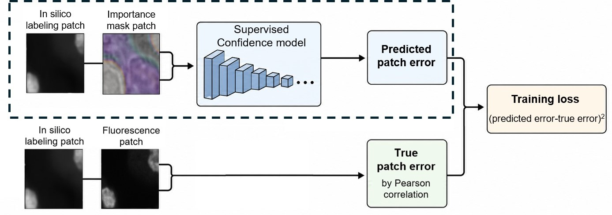
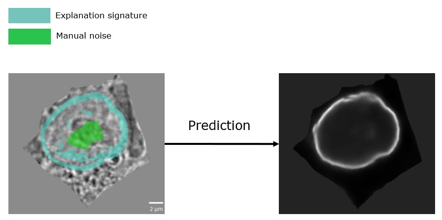

# Mask Interpreter Applications for In Silico Labeling

This repository accompanies research from the [Zaritsky Lab of Computational Cell Dynamics](https://www.assafzaritsky.com/) on interpretability and confidence estimation for in silico labeling predictions. It provides two complementary applications of Mask Interpreter: a supervised confidence model that estimates patch-level in silico labeling performance using the predicted fluorescence image and its corresponding importance mask, and a single-cell workflow that generates importance masks and explanation signatures for single-cell in silico labeling predictions.

Preprint link will be added upon publication.

## Project Description

The two applications address different questions and are provided as independent workflows, each with dedicated code, configuration, environment, and documentation.


### Supervised Confidence

The supervised confidence workflow estimates patch-level in silico labeling performance from two inputs: the in silico labeling prediction and its corresponding importance mask. A 3D regression model predicts the in silico labeling error, which is converted into a confidence score for identifying predictions that may be unsuitable for downstream biological analysis.



[View the Supervised Confidence documentation](Supervised_Confidence/README.md)

### Single-Cell Mask Interpreter

The Single-Cell Mask Interpreter workflow applies Mask Interpreter to single-cell in silico labeling predictions. It generates importance masks that identify image regions important for preserving each prediction, enabling explanation signatures to be examined at single-cell resolution.



[View the Single-Cell Mask Interpreter documentation](Single_Cell_Mask_Interpreter/README.md)

---

## Repository Structure

```text
MaskInterpreter-Applications/
├── README.md
├── LICENSE
├── images/
├── Supervised_Confidence/
└── Single_Cell_Mask_Interpreter/
```

The repository is organized into two independent workflows:

* [`Supervised_Confidence/`](Supervised_Confidence/README.md) contains the notebooks, source code, configuration templates, and documentation for training and applying the supervised confidence model.
* [`Single_Cell_Mask_Interpreter/`](Single_Cell_Mask_Interpreter/README.md) contains the notebooks, source code, configuration templates, and documentation for applying Mask Interpreter to single-cell in silico labeling predictions.

Large data files, pretrained models, and precomputed analysis results are distributed separately through Zenodo. Their download and configuration are described in the relevant workflow documentation.

---
## Models, Data & Access

Large microscopy data, pretrained model checkpoints, and precomputed results are distributed separately and are not tracked directly in this GitHub repository.

### Shared Mask Interpreter Resources

The [original Mask Interpreter Zenodo record](https://doi.org/10.5281/zenodo.18590674) provides the shared resources used by these workflows, including pretrained in silico labeling and field-of-view Mask Interpreter models, Nuclear-envelope field-of-view example data, and train/test lists for the full datasets.

### Application-Specific Resources

Resources introduced by the applications in this repository are available through the [Mask Interpreter Applications Zenodo record](https://doi.org/10.5281/zenodo.20522083). These resources include pretrained supervised confidence models, supervised-confidence analysis results, single-cell Mask Interpreter models, and single-cell example data.

The exact files required by each workflow and their expected directory configuration are described in the dedicated documentation:

* [Supervised Confidence](Supervised_Confidence/README.md)
* [Single-Cell Mask Interpreter](Single_Cell_Mask_Interpreter/README.md)

Full microscopy datasets are not redistributed through this repository or its companion Zenodo record. Instructions for obtaining and preparing the full datasets from their original sources are provided in the relevant workflow documentation.

---

## Quick Start

Clone the repository:

```bash
git clone https://github.com/zaritskylab/MaskInterpreter-Applications.git
cd MaskInterpreter-Applications
```

Then choose one of the two project workflows below.

### Supervised Confidence

```bash
cd Supervised_Confidence

conda create -n supervised_confidence python=3.10.14
conda activate supervised_confidence

pip install -r requirements.txt
```

After installing the environment:

1. Download `confidence_data-20260603T070348Z-3-001.zip`, `confidence_data-20260603T070348Z-3-002.zip`, and `confidence_models-20260603T070310Z-3-001.zip` from Zenodo.
2. Place the files under the expected `data/` and `models/` directories described above.
3. Open the demonstration notebook:

```bash
jupyter notebook notebooks/inference.ipynb
```

The demonstration notebook runs inference with the pretrained confidence model on the nuclear envelope example data. It does not retrain the model and does not overwrite downloaded checkpoints.

Additional notebooks are provided for training, evaluation, and figure generation. See the local project instructions in `Supervised_Confidence/README.md`.

### Single Cell Mask Interpreter

From the repository root:

```bash
cd Single_Cell_Mask_Interpreter

conda create -n single_cell_mask_interpreter python=3.9.15
conda activate single_cell_mask_interpreter

pip install -r requirements.txt
```

After installing the environment:

1. Download `single_cell_models-20260603T070159Z-3-001.zip` from Zenodo.
2. Place the files under the expected `models/` directory described above.
3. Open the demonstration notebook:

```bash
jupyter notebook notebooks/inference.ipynb
```

The demonstration notebook runs MaskInterpreter on the nuclear envelope single-cell example data. It does not retrain the model and does not overwrite downloaded checkpoints.

Additional notebooks are provided for training and inference with or without context. See the local project instructions in `Single_Cell_Mask_Interpreter/README.md`.

---

## Citation

If you use this repository, please cite the associated paper and repository.

### Repository

```bibtex
@misc{Trustworthy_in_silico_labeling_2026,
  title        = {Trustworthy in silico labeling via semantic visual interpretability of image-to-image translation},
  author       = {Miller, Gad and Ben Nedava, Lion and Zaritsky, Assaf},
  year         = {2026},
  howpublished = {\url{https://github.com/zaritskylab/MaskInterpreter-Applications}},
  doi          = {10.5281/zenodo.20522083}
}
```

### Paper

```bibtex
@article{Trustworthy_in_silico_labeling_2026,
  title   = {TODO},
  author  = {TODO},
  journal = {Preprint},
  year    = {2026},
  doi     = {TODO}
}
```

## Related Repositories and Credits

This work was carried out in collaboration with Lion Ben Nedava. Related MaskInterpreter code can be found here:

https://github.com/zaritskylab/MaskInterpreter

The single-cell in silico labeling component builds on the CELTIC framework:

https://github.com/zaritskylab/CELTIC

## Contact

For questions, please contact:

- Gad Miller: gadmicha@post.bgu.ac.il
- Lion Ben Nedava: lionben89@gmail.com
- Prof. Assaf Zaritsky: assafzar@gmail.com

## License

This repository is intended for academic and research use and is licensed under CC BY-NC 4.0. See [LICENSE](LICENSE) for details.
